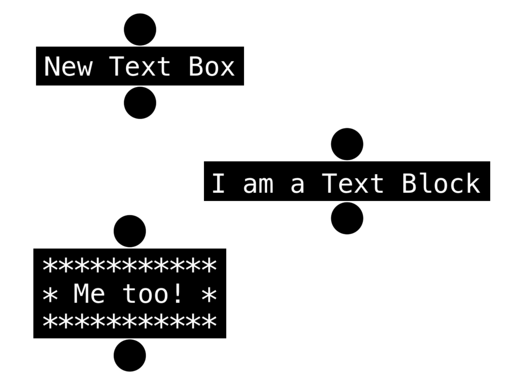
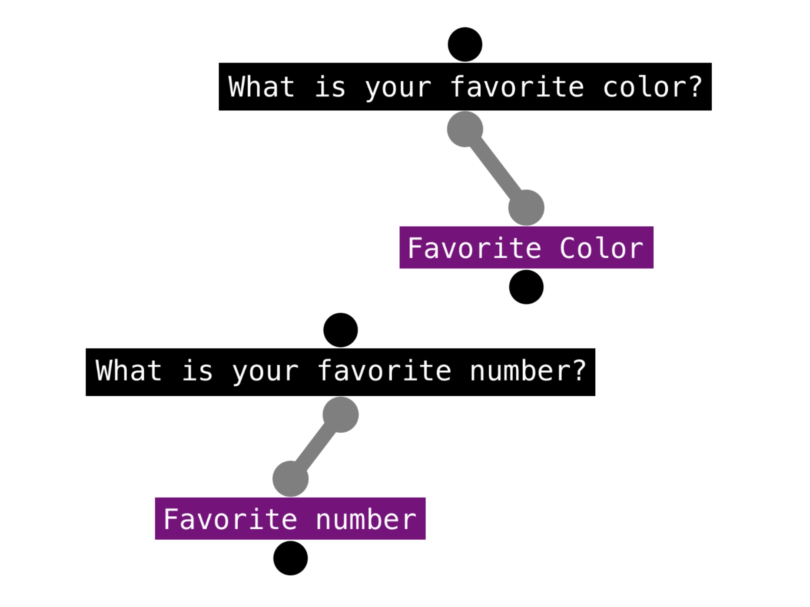
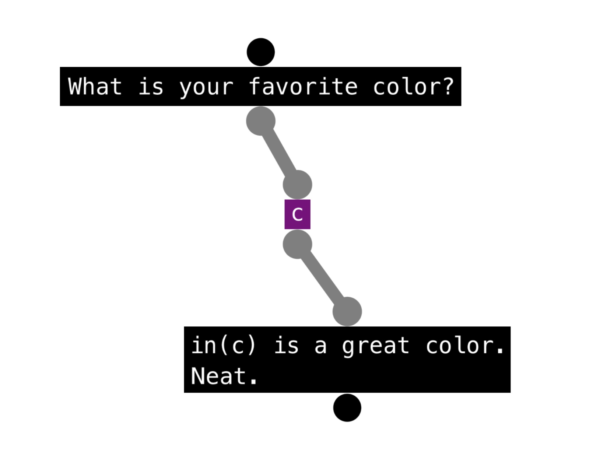
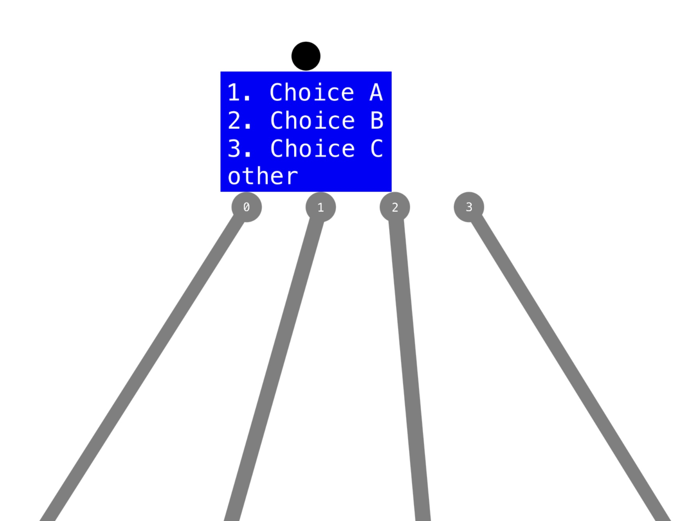

# **Part 1-1 - My own Project File**

- Goals
- My First Program
- Explaining the Program

---
## **Goals**

My goal for this was to create a `String` that can be read by a program, and become turned into a game (hopefully an interactive text adveture). I started out by creating a Command Line app (not working with SpriteKit just yet).

I asked myself, "What basic features are there in a text adventure?"

I came up with:
- Output (Regular Output | Interpolated Output)
- Input (Unrestricted Input | Multiple Choice)
- Control Flow (Logic | Loops | Methods | Recursion)
- Values (Local | Global | Persisting)
- Operations (Addition | etc)

This is a long list. At the beginning, I trimmed it down to this:
- Output (Both Regular and Interpolated)
- Unrestricted Input
- Persisting Values

---
## **My First Program**

Here is my first program:
```swift
let file = "0…text…Enter your name:…11…input…name…22…text…Welcome, in(name), to the Game!…end"
```

You can see the `` and `…` symbols. These are very important in my file.
- `` - Separates each block
- `…` - Separates items within the block

One important thing to note is that this program is highly unreadable. Readability for humas was not what I was aiming for. Instead, I wanted to make it as easy as possible for a program to decipher. For example, photos are turned into a list of numbers, and the computer reads it and turns it into a photo that we can see. Same goes for this game.

I decided that blocks would follow this format:

Block Name | Block Type | Block Values... (List) | Points to Block |
:--: | :--: | :--: | :--:
0 | text | Enter your name: | 1
1 | input | name | 2
2 | text | Welcome, in(name), to the Game! | end

What does ***Points to Block*** mean? This means that, after a block has been evaluated, we will evalutate the block that is pointed to. For example, Block 0 is runs first. It points to Block 1. Once Block 0 has evaluated (basically it prints 'Enter your name'), my program will move in to Block 1.

When does the program end? If a pointer points to the word 'end', the program finishes.

---
## **Explaining the Program**

- As you can see, I started out with 2 block types: text and input.
- You might even notice the interpolated output `in(name)`.

What does it do?
 1. It asks for your name.
 2. You type your name (or nickname).
 3. It welcomes you, using your name.

---


# **Part 1-2 - Defining Block Types**

- List of Blocks
- Text Block
- Enum

---
## **List of Blocks**

I will now list out all the different kinds of blocks in the finished product. This is a very superficial list.

- **Text Block:** A List of Strings to print.
- **Input Block:** Prompts the user to make an input. This value gets saved forever.
- **Choice Block:** Prompts the user to select an option wihtin a multiple choice. Based upon a selected option, a route is taken.
- **If Block:** Takes a route based upon a condition.
- **Code Block:** Evaluates some code under the hood.
- **Func Block:** Starts a method. Can be called ina code block: `start()` will point to the starter block.

---
## **Text Box**

Text Blocks are what people use most. This is how you can tell your store, prompt users, etc.

- Multiple Lines - Input Boxes cannot have multiple lines.
- Pointers - Input Boxes can point to 1 other block.



---
## **Input Box**

Input Boxes prompt the user to make an input. This value gets saved forever. Note the use of the black Text Boxes promtping before the inputs.

- Multiple Lines - Text Boxes can have multiple lines.
   - eheh
- Pointers - Text Boxes can point to 1 other block.

If you want to use whatever the user inputted, just say, `in(Favorite Color)` in a text box.

Notice the Purple boxes? These are input boxes. Why is there the word "Favorite Color" inside one? This means that whatever the user inputs, that value gets saved under the "Favorite Color" slot.

It'd be like saying: `let favoriteColor = readLine()!`



You can also ask the user again what their favoriter color is. If they input something different, the old value is deleted. All you have to do is create 2 purple Input Boxes with the same storage value.

The name of your value doesn't matter. The user will never see it. You can use whatever name you like. Here's an example where the name is just the letter `c`:




---
## **Multiple Choice Box (aka Q&A Box)**

A Mulitple Choice Box prompts the user




---
## **Interpolating Saved Values**


---
## **Enum**

I used an enum to make a list of block types!

```swift
enum Optable {
    
    case text(print: [String], to: String)
    case start(name: String, to: String)
    case input(knowledge: String, to: String)
    case `if`(this: String, to: (String, String))
    case choice(choices: [(chose: String, to: String)])
    case code(this: [String], to: String)
}
```

---


# **Part 1-3 - Deciphering the File**

- HHH

---
## **HHH**

Let's say I have my first program here:
```swift
let file = "0…text…Enter your name:…11…input…name…22…text…Welcome, in(name), to the Game!…end"
```

Turns out I can easily split this up into blocks using Apple's `split` method:

```swift
let lines = file.filter { $0 != "\n" }.split(separator: "")
```
This removes any New Line characters `\n`, and then splits the program into blocks (Remember the `` separates blocks)

So then, `lines` looks like this:

```swift
[
    "0…text…Enter your name:…1",
    "1…input…name…2",
    "2…text…Welcome, in(name), to the Game!…end"
]
```


---